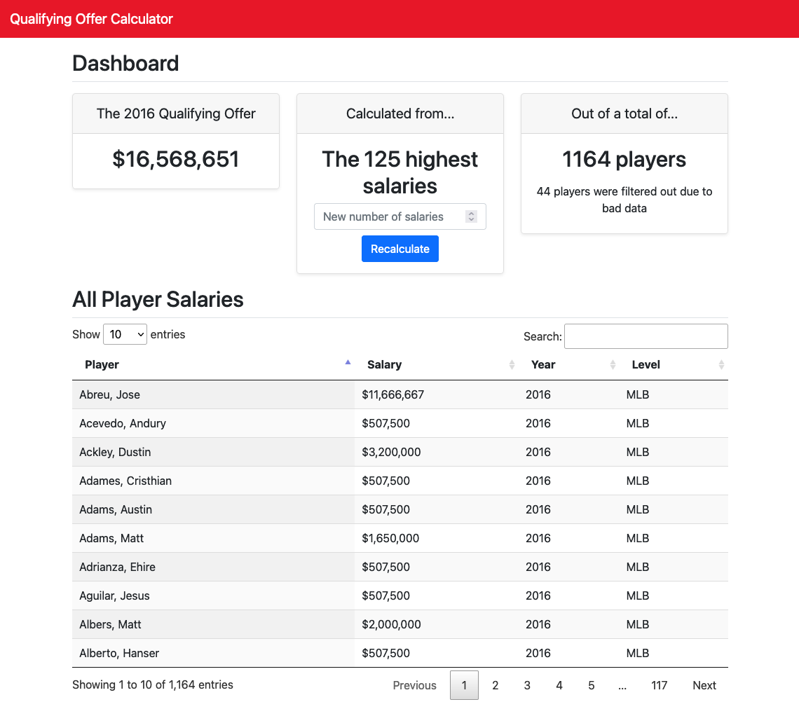

# The Qualifying Offer Calculator

## Description

This is an application for calculating a qualifying offer for MLB based on a population of player salary data.

It contains two run modes :

1. A simple command line interface :

```
python runner.py --help
Usage: runner.py [OPTIONS]

Options:
  --number_of_salaries INTEGER  The number of highest salaries to use when
                                calculating the qualifying offer
  --show_top_salaries           Optionally show the top players salaries
  --verbose                     Run the program in verbose mode
  --help                        Show this message and exit.
```

```
python runner.py --verbose
DEBUG:calculator.core.salary_calculator:Reading HTML-based salary data from url=[https://questionnaire-148920.appspot.com/swe/data.html]
DEBUG:calculator.core.salary_calculator:Replacing empty strings and NaNs within 'Salary' column. Number of rows = [1208]
DEBUG:calculator.core.salary_calculator:Filtering illegal strings from 'Salary' column. Number of rows = [1208]
DEBUG:calculator.core.salary_calculator:Normalizing 'Salary' column to convert currency into a number. Number of rows = [1175]
DEBUG:calculator.core.salary_calculator:Calculating the qualifying offer for the top [$125] salaries
DEBUG:calculator.core.salary_calculator:Taking the top [125] salaries. Number of rows = [1175]
DEBUG:calculator.core.salary_calculator:Calculating the mean of the top [125] salaries. Number of rows = [125]
{
    "number_of_salaries": 125,
    "qualifying_offer": 16727394,
    "meta": {
        "prefiltered_row_count": 1208,
        "postfiltered_row_count": 1175
    }
}
```

2. A simple Flask app that renders a website

```
python app.py
 * Serving Flask app 'calculator' (lazy loading)
 * Environment: development
 * Debug mode: on
[2021-10-09 11:49:33,202] | WARNING | _internal:225 |  * Running on all addresses.
   WARNING: This is a development server. Do not use it in a production deployment.
[2021-10-09 11:49:33,202] | INFO | _internal:225 |  * Running on http://10.0.0.145:5000/ (Press CTRL+C to quit)
[2021-10-09 11:49:33,203] | INFO | _internal:225 |  * Restarting with stat
[2021-10-09 11:49:33,406] | INFO | __init__:19 | Initializing Flask application with log level = [DEBUG]
[2021-10-09 11:49:33,751] | INFO | app:4 | We have just created a Flask app!
[2021-10-09 11:49:33,752] | INFO | app:7 | It looks like we're running locally via __main__...starting the app in debug mode
[2021-10-09 11:49:33,757] | WARNING | _internal:225 |  * Debugger is active!
[2021-10-09 11:49:33,764] | INFO | _internal:225 |  * Debugger PIN: 502-488-608
[2021-10-09 11:49:44,670] | INFO | _internal:225 | 127.0.0.1 - - [09/Oct/2021 11:49:44] "GET /calculator HTTP/1.1" 200 -
```



## Setup

1. Create and activate a virtual environment with python 3.8+
    1. This project uses python version 3.8.12 specifically and has been configured using pyenv & pyenv-virtualenv
2. Install the requirements :
    1. `pip install -r requirements.txt`
3. Try out the command line interface first :
    1. `python runner.py --verbose`
4. Finally, try out the flask app :
    1. Run `python app.py`
    2. Go to http://localhost:5000/calculator
    3. Play around with the data! You can search, sort, and adjust the number of players used in calculating the
       qualifying offer with the query parameter number_of_salaries=99